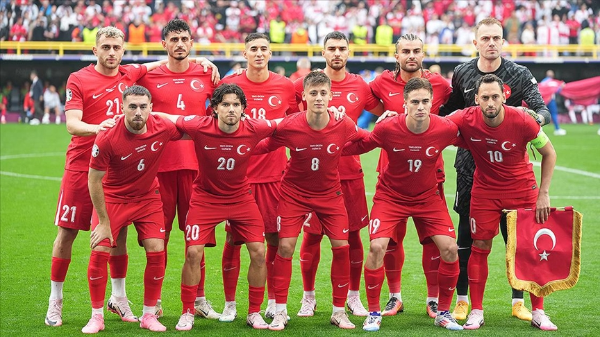

🏆⚽ Euro 2024 Turkey National Team Performance Analysis 📊🔍

I took a detailed look at the performance of the Turkish National Team at Euro 2024 and analyzed it through various visualizations. The study includes various graphs and heatmaps to better understand Turkey's performance throughout the tournament. The data was sourced from StatsBomb and analyzed to provide more comprehensive and reliable results.

Heat Map 🔥📍: I have visualized the areas where the Turkish National Team players were most active on the pitch during the matches. This map shows which areas the team was more active and which areas were more defensive or offensive. 🌍⚽

Pass Map ⚽🗺️: I analyzed the distribution of the team's passes on the pitch during the matches. The passing map reveals the team's game strategy and where they move the ball more. 🏃‍♂️📈

Shot Map 🎯📊: I visualized the distribution and accuracy of the shots taken in the matches on the pitch. This map shows where more shots are taken and where they are concentrated. 🔄⚽

Dribbling Map 🚀⚽: I analyzed how the dribbling of the players is distributed on the pitch and in which areas the dribbling is concentrated. This chart provides information about the team's offensive strategies. 🏃‍♀️💨

Zone Analysis 🏟️🔍: I visualized the passes and dribbles in the third zone (1/3 of the field). This graph shows Turkey's strategy to approach the opponent's goal and how effective they are in this zone. ⚽🏆
Pass Heat Map 🔥⚽: I visualized the intensity and distribution of Turkey's passes on the pitch during the matches. This map details the team's passing tendencies and mobility on the pitch. 📍📊

Top 10 Players 🥇🥇📋: I ranked the Turkish national team players from best to worst according to their overall effectiveness (passing, shooting, dribbling). This analysis was used to compare the players' performances and identify the most effective players. 🌟🏅

These visualizations are designed to better understand Turkey's performance in the Euro 2024 tournament and to assess in detail the on-field contributions of the players. The visualizations and analysis allow us to dig deeper into the team's strategic approaches and individual player performances. This comprehensive perspective helps us understand how effective Turkey was in the tournament and where improvements are needed!!!!. 🚀📊

